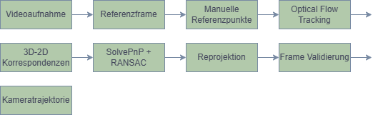
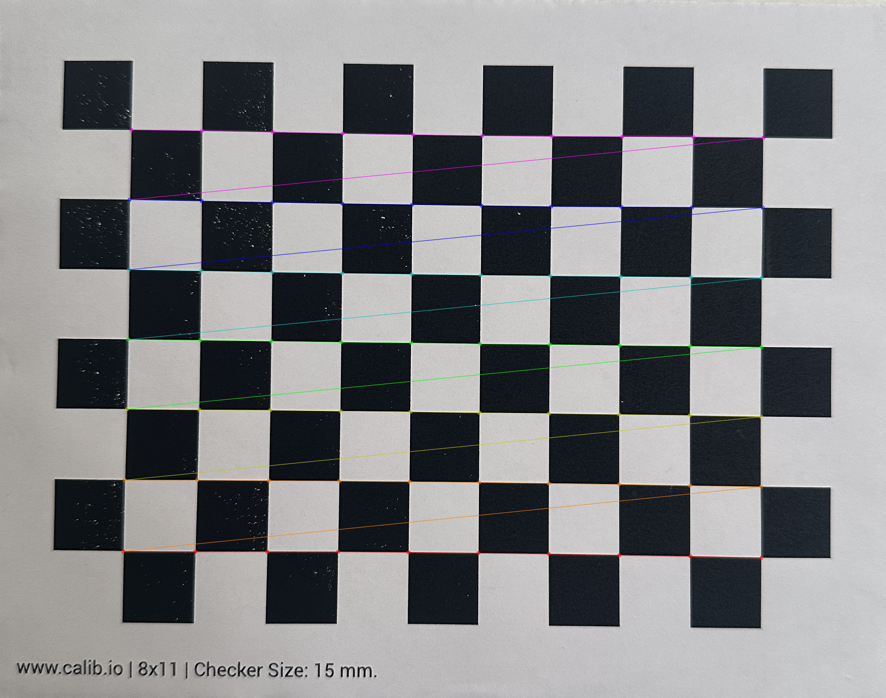
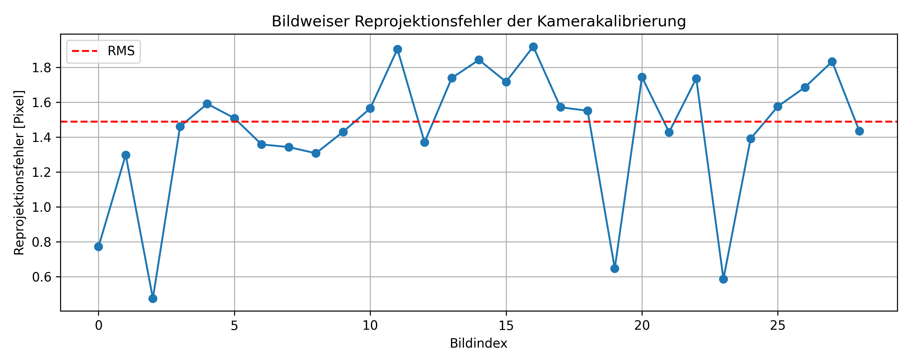
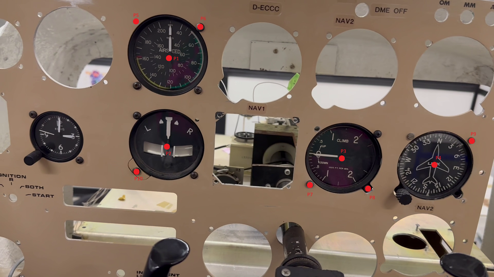
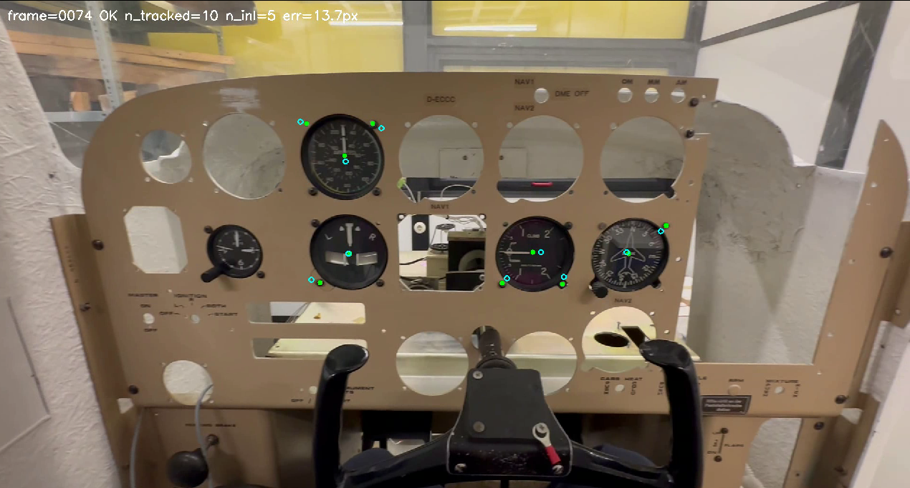
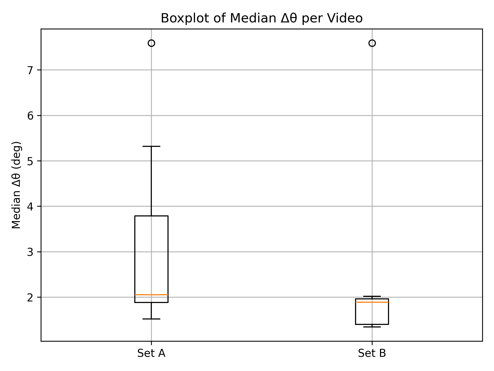
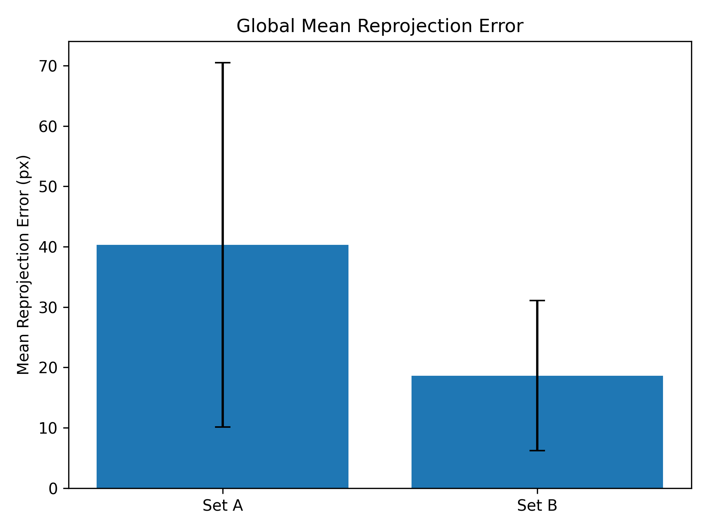
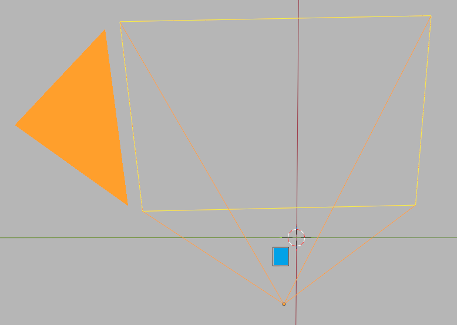

# vr-headset-cockpit-tracking
Camera-based inside-out tracking pipeline for estimating the position and orientation of a VR headset in an aircraft cockpit enviroment.
Developed as part of a Bachelor´s Thesis in Computer Science at Philipps University Marburg.

---

## Overview
This Project implements a complete computer vision pipeline for camera-based tracking of a VR headset using a smartphone camera and known cockpit reference points.
The objective is to reconstruct the position and orientation of the camera relative to the cockpit structure from video recordings. 
The implemented pipeline combines:
- Camera calibration
- Feature tracking
- Pose estimation
- Reprojection error analysis
- Trajectory reconstruction
- Result evaluation and comparison
- Geometric validation in Blender

---

## Tracking Pipeline


The Processing workflow consists of:

1. Video acquisition
2. Reference point definition
3. Camera calibration
4. Optical-flow-based feature tracking
5. Pose estimation using SolvePnP + RANSAC
6. Reprojection validation
7. Trajectory reconstruction
8. Evaluation and visualization

---

## Camera Calibration

The smartphone camera is calibrated using checkerboard images and OpenCV´s implementation of Zhang´s camera calibration method.

### Calibration Features

- Intrinsic camera matrix estimation
- Lens distortion estimation
- Reprojection error computation
- Validation using multiple checkerboard images

### Example Calibration Pattern



### Reprojection Error Analysis



---

## Reference Point Definition

Known cockpit reference points are manually selected and linked to corresponding 3D coordinates.
These 3D-2D correspondences form the basis for the pose estimation process.



---

## Feature Tracking

The selected cockpit reference points are automatically tracked throughout the video sequence using optical flow methods.
The tracking pipeline continuously validates point visibility and tracking quality.

### Example Tracking Result



---

## Pose Estimation

For each frame, the camera pose is estimated using:

- OpenCV SolvePnP
- RANSAC outlier rejection
- Known cockpit geometry
- Tracked image features

Estimated outputs:

- Camera position (x, y, z)
- Camera orientation (roll, pitch, yaw)

This enables reconstruction of the full camera trajectory over time.

---

## Evaluation

Two different cockpit reference-point configurations (Set A und Set B) were evaluated and compared.

### Average p95 Angular Error


### Median Angular Error Distribution



### Global Reprojection Error Comparison



The evaluation demonstrates the influence of reference-point configuration on tracking stability and pose-estimation accuracy.

---

### Blender Validation

The estimated camera poses were additionally validated through geometric reconstruction and visualization in Blender.

### Example Validation



---

## Project Structure

```text
vr-headset-cockpit-tracking/

├── camera_calibration/
│   ├── calibrate_camera.py
│   ├── plot_reprojection_errors.py
│   └── calibration utilities
│
├── tracking/
│   ├── track_and_solvepnp.py
│   ├── extract_video_frames.py
│   └── tracking utilities
│
├── analysis/
│   ├── analyze_poses.py
│   ├── analyze_dtheta_dt.py
│   ├── make_comparison_table.py
│   └── evaluation scripts
│
├── visualization/
│   └── blender_script.py
│
├── assets/
│   └── README images
│
└── results/
    └── generated evaluation outputs
```

---

## Technologies

### Programming Language

- Python

### Libraries

- OpenCV
- NumPy

### Computer Vision

- Camera Calibration
- Zhang Calibration Method
- Optical Flow Tracking
- Feature Tracking
- Pose Estimation
- SolvePnP
- RANSAC
- Reprojection Error Analysis

### Visualisation

- Blender

---

## Academic Context

Bachelor Thesis

**Development of a camera-Based Inside-Out Tracking System for AR/VR Applications in Aircraft Cockpit Environments**
Philipps University Marburg
The original thesis was written in German.

---

## Key Learning Outcomes

- Design and implementation of a complete computer vision pipeline
- Camera calibration and validation
- Optical-flow-based feature tracking
- Robust pose estimation using OpenCV
- Quantitative evaluation of tracking quality
- Geometric validation using Blender
- Scientific software development in Python

---

## Author

**Seunghee Keil**

B.Sc. Computer Science

B.Sc. Automotive Engineering

GitHub: http://github.com/SKeil123

LinkedIn: 